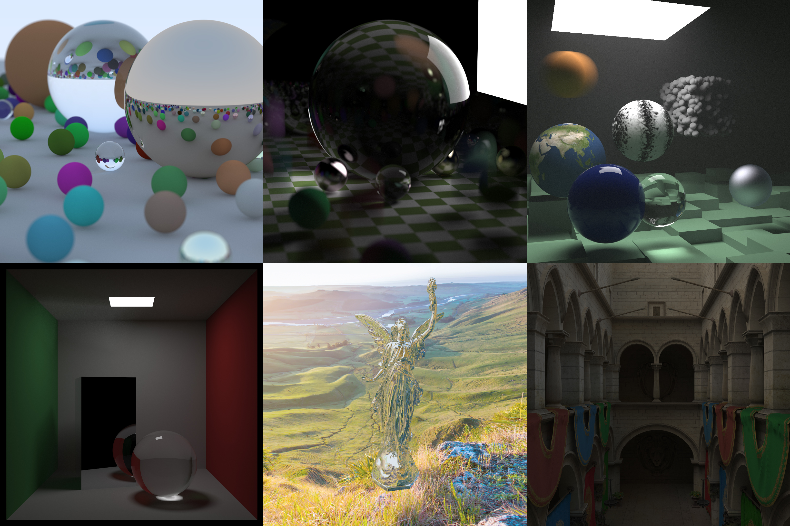

# OptiX Path Tracer



## Overview

NVIDIA's OptiX based GPU Path Tracer. Project originally forked from Ingo Wald's OptiX version of Peter Shirley's "Ray Tracing" series, still being 
expanded with new features being added even after being done with the final book, "The Rest of Your Life". Accompanying blog posts describing the implemention are available in the following links:

- ["Ray Tracing: The Next Week" In OptiX](https://joaovbs96.github.io/posts/next-week/)
- ["Ray Tracing: The Rest of Your Life" In OptiX](https://joaovbs96.github.io/posts/rest-life/)


## Features

- Pinhole Camera
- BRDFs:
  - Lambertian
  - Ideal Dielectric(Glass)
  - Ideal Metal
  - Ashikhmin-Shirley
  - Torrance-Sparrow
  - Oren-Nayar
  - Normal Shader
  - Volumetric Material(WIP)
- Surfaces:
  - Triangle Meshes
  - Spheres
  - Rectangles
  - Boxes
- Russian Roulette Path Termination
- Multiple Importance Sampling
- HDRi Environmental Mapping & Tone Mapping

### TODO:
- BRDFs:
  - [Disney's BSDF](https://schuttejoe.github.io/post/disneybsdf/)
- Surfaces:
  - Torus
  - Cone
  - Cylinder
- OptiX's Motion Blur
- Bump Mapping
- Spectral Rendering


## Further reading

- [Peter Shirley's original C++ code](https://github.com/petershirley/raytracinginoneweekend)
- [Peter Shirley's Ray Tracing books](https://www.amazon.com/Ray-Tracing-Weekend-Minibooks-Book-ebook/dp/B01B5AODD8)
- [Roger Allen's blog post about his CUDA version of "In One Weekend"](https://devblogs.nvidia.com/accelerated-ray-tracing-cuda/)
- [Ingo Wald's OptiX version of "In One Weekend"](https://github.com/ingowald/RTOW-OptiX)


## Prerequisites

- A install of CUDA, preferably CUDA 10 or above. Make sure to put your CUDA binary directory into your path;
- A install of OptiX 6.0.0 or above. A Maxwell or newer GPU is also needed, as we make use of RTX-mode only features.
- Compiler and build tools - GCC, MSVC, CLang, etc;
- CMake.


## Included Third-Party Libraries

- [straaljager's HDRloader](https://github.com/straaljager/GPU-path-tracing-tutorial-4/blob/9b0906f2850ae15833f16fa0e992208ac60cc1bd/HDRloader.cpp)
- nothings' [stb_image](https://github.com/nothings/stb/blob/master/stb_image.h) and [stb_image_write](https://github.com/nothings/stb/blob/master/stb_image_write.h)
- [syoyo's tinyobjloader](https://github.com/syoyo/tinyobjloader)


## Building

- This project is built with CMake. On Linux, simply create a build
directory, and start the build with with ccmake:

   mkdir build
   cd build
   cmake ..
   make

- Assuming you have NVCC (CUDA) in your path, and have set a
```OptiX_INSTALL_DIR``` environment variable to point to the OptiX
install dir, everything should be configured automatically;
- You can set NVCC flags through the macro cuda_compile_ptx in the file
```OptiX-Path-Tracer/cmake/configure_optix.cmake```. Keep in mind that the flag 
```--relocatable-device-code=true;``` is needed to make use of callable 
programs if you are building the project using the CUDA SDK 8.0 or superior.
An InvalidSource exception will happen if you fail to do so.


## Running

- Run the ./OptiX-Path-Tracer binary (OptiX-Path-Tracer.exe on windows). This
should render a PNG image under the output folder(that needs to be 
created on ahead). To change image resolution, 
and number of samples just edit ```OptiX-Path-Tracer/main.cpp```;
- On Windows, you might see a "DLL File is Missing" warning. Just copy the missing 
file from ```OptiX SDK X.X.X/SDK-precompiled-samples``` to the build folder.


## Code Overview
  
- Host code, functions and constructors are separated into the main.cpp and different header files under the ```host_includes/``` folder;
- Device related code is in the ```programs/``` folder;
- The ```OptiX-Path-Tracer/CMakeLists``` scripts sets up the build; in particular, it defines all the CMake rules for compiling the device programs, embedding them into host object files, and linking them tothe final binary;
- Ingo Wald made two different versions of the code, a recursive one and an iterative one(better suited to GPUs). On my fork, I decided to keep the iterative version only, but you can still check his original code on his repository;
- This project uses Clang-Format(Google's style with tab width equal to 2) to keep code style consistent.
